<!-- Artwork in assets/ is generated by tools/gen_assets.py and served by
     GitHub itself, so nothing here depends on a third-party image service. -->

 

## About

Computer Science & Engineering student at **North South University**, in Dhaka.

I work where **language understanding** meets **visual perception** — retrieval systems that stay honest about their sources, vision models that earn their accuracy, and the unglamorous plumbing that turns either one into something a person can actually use. Most of what I build starts as a paper I couldn't stop thinking about, and ends as a service with a health check.

Open to research collaboration, open source, and a good argument about attention mechanisms.

 

## The Stack, End to End

  

  

 

## Research Interests

<table>
<tr>
<td width="50%" valign="top">

**Language**
- Natural Language Processing
- Large Language Models
- Retrieval-Augmented Generation

</td>
<td width="50%" valign="top">

**Vision & Beyond**
- Computer Vision
- Multimodal AI

</td>
</tr>
</table>

 

## Philosophy

> ### *"Artificial Intelligence should amplify human intelligence, not replace it."*

 

## Let's Connect

If you're working on something interesting in NLP, vision, or multimodal AI — reach out.

 

